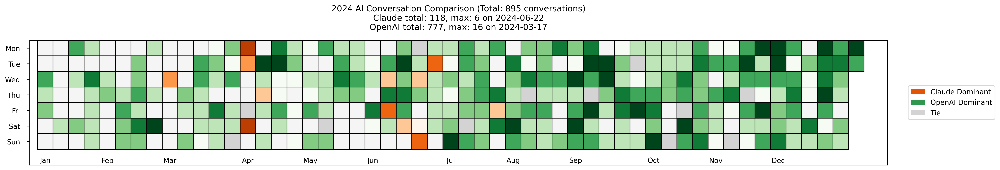
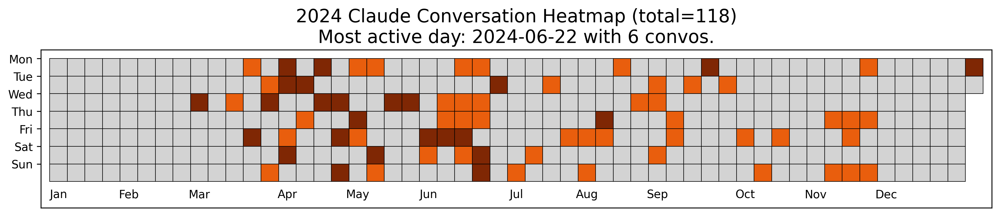
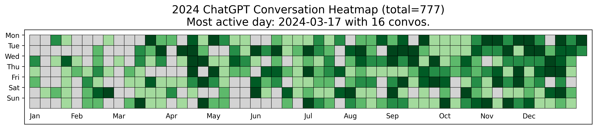

# AI Usage Heat Map Visualization

A GitHub-style heat map visualization tool that shows your AI assistant usage patterns over time. This tool allows you to see when you use ChatGPT and Claude throughout the year and compare your usage patterns between the two AI assistants.



## Features

- 📊 Individual heat maps for ChatGPT and Claude
- 🔄 Comparison heat map showing which assistant you use more on each day
- 📅 Beautiful calendar-style visualization with color intensity showing usage volume
- 📆 Generate visualizations for specific years or all years at once
- 🌐 Configurable timezone support (defaults to Asia/Kolkata)
- 📁 Organized output files in a dedicated visualization directory

## Why Use This Tool?

- **Understand Your AI Usage Patterns**: See when you're most active with each AI assistant
- **Compare Usage**: Are you using ChatGPT more than Claude? This tool shows you exactly when
- **Track Changes Over Time**: Analyze how your usage patterns evolve across years
- **Identify Peak Usage**: Find your most active days with each assistant

## Setup

1. **Install Required Packages**:
   ```bash
   pip install matplotlib numpy pytz
   ```

2. **Export Your Conversation Data**:
   - **ChatGPT**: Settings → Data controls → Export
   - **Claude**: Settings → Account → Data → Export data

3. **Update Configuration**:
   - Place your exported data folders in the same directory as the script
   - Open `generate_heatmap.py` and update these configuration settings:
     ```python
     chatgpt_folder = 'your_chatgpt_export_folder'  # Replace with your folder name
     claude_folder = 'your_claude_export_folder'    # Replace with your folder name
     local_tz = 'Asia/Kolkata'  # Set to your timezone (e.g., 'US/Eastern', 'Europe/London')
     ```

## Usage

### Using the Batch File (Windows)

Run the batch file with an optional year parameter:

```bash
generate_visualizations.bat 2023     # Generate for a specific year
generate_visualizations.bat all      # Generate for all available years
```

If no year is specified, it will process all available years.

### Using Python Directly

Run the Python script with an optional year parameter:

```bash
python generate_heatmap.py 2023     # Generate for a specific year
python generate_heatmap.py          # Generate for all available years
```

If no year is specified, it will process all available years.

## Output

The visualizations will be saved to the `visualizations` folder:

- `claude_heatmap_YEAR.png` - Claude usage heat map
- `chatgpt_heatmap_YEAR.png` - ChatGPT usage heat map
- `comparison_heatmap_YEAR.png` - Comparison showing which assistant is used more each day

The script will automatically generate visualizations for each year with available conversation data.

## Visualization Explained

The comparison heat map uses:
- 🟠 **Orange cells** for days with more Claude usage
- 🟢 **Green cells** for days with more ChatGPT usage
- ⚪ **Gray cells** for days with equal usage

The intensity of the color indicates the volume of conversations on that day.

## Example Images

<details>
<summary>Click to see example visualizations</summary>
<br>

### Claude Usage Heatmap


### ChatGPT Usage Heatmap


### Comparison Heatmap


</details>

## Jupyter Notebook Version

For a more interactive experience, check out the `ai_usage_analysis.ipynb` notebook which includes:
- All the heatmap visualizations
- Additional charts for time-of-day and day-of-week analysis
- Monthly usage trends
- Code you can run cell-by-cell and modify as needed

## Contributing

Contributions are welcome! Feel free to:
- Add new visualization types
- Improve the code
- Fix bugs or issues
- Suggest new features

## License

This project is licensed under the MIT License - see the LICENSE file for details.

## Acknowledgments

- Inspired by GitHub's contribution heat map
- Built for analyzing AI assistant usage patterns
- Uses matplotlib for visualization

---

*Note: This project is not affiliated with OpenAI or Anthropic.* 